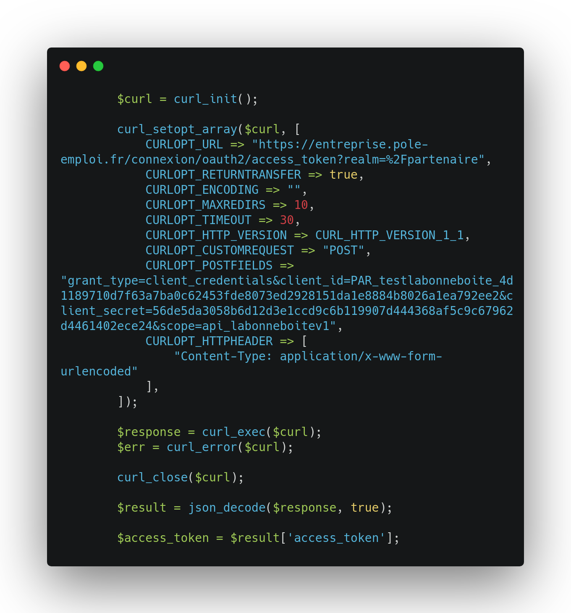

# Déploiement de l'application en local 

Se rendre sur https://github.com/jenniferchaul/test1

Aller sur l'onglet "code", clé SSH et copier la clé suivante : git@github.com:jenniferchaul/test1.git

Dans le terminal créer un nouveau dossier  : `mkdir nom dossier`

Puis lancer la commande suivante : `git clone git@github.com:jenniferchaul/test1.git`

Nous avons à présent l'intégralité du dossier.

Pour lancer le serveur local effectuer la commande : `php -S 0.0.0.0:8080 -t public`

# Les différentes étapes du test

Création de l'application via la commande `composer create-project symfony/website-skeleton lenomduprojet`

Utilisation du client Insomnia pour tester l'obtention :

- d'un token afin d'accéder à l'api "la bonne boite".

---

- des infos sure les entreprises ayant le plus haut potentiel d'embauche
- 

# Création du controller HomeController

Commande pour la création d'un controller :  `bin/console make:controller Home`

# Utilisation de Curl pour obtenir le token indispensable pour consommer l'api + stockage du token dans une variable.

# Mise en place du http client pour récuper les données de l'api externe : 

https://symfony.com/doc/current/http_client.html

Dynamisation de la route en utilsant des variables pour le code insee et le code rome.

# Mise en place du limter rate.

création d'un fichier rate_limiter.yaml dans config/packages avec les paramétres suivant (pour test)

Limiter rate : https://symfony.com/doc/current/rate_limiter.html

Installation de limiter rate avec : `composer require symfony/rate-limiter`

création d'un fichier rate_limiter.yaml dans config/packages :
`
framework:
    rate_limiter:
        anonymous_api:
            # use 'sliding_window' if you prefer that policy
            policy: 'fixed_window'
            limit: 2
            interval: '5 minutes'

