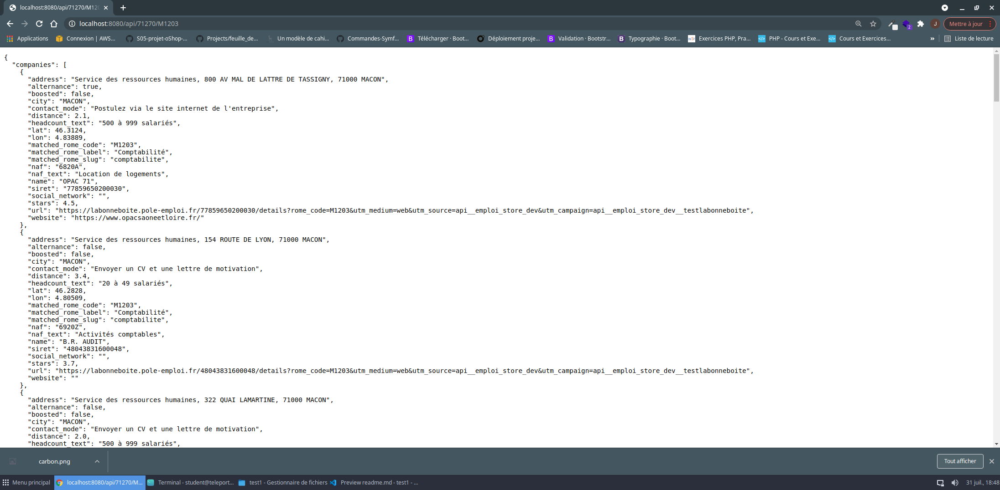

# Déploiement de l'application en local 

Se rendre sur https://github.com/jenniferchaul/test1

Aller sur l'onglet "code", clé SSH et copier la clé suivante : git@github.com:jenniferchaul/test1.git

Dans le terminal créer un nouveau dossier  : `mkdir nom dossier`

Puis lancer la commande suivante en incorporant la clé SSH récupérée précédemment : `git clone git@github.com:jenniferchaul/test1.git`

Nous avons à présent l'intégralité du dossier.

Pour lancer le serveur local effectuer la commande : `php -S 0.0.0.0:8080 -t public`

# Les différentes étapes du test

Création de l'application via la commande `composer create-project symfony/website-skeleton lenomduprojet`

Utilisation du client Insomnia pour tester l'obtention :

- d'un token afin d'accéder à l'api "la bonne boite".

---

- des infos sur les entreprises ayant le plus haut potentiel d'embauche
- 

# Création du controller HomeController

Commande pour la création d'un controller :  `bin/console make:controller Home`

# Utilisation de Curl pour obtenir le token indispensable pour consommer l'api + stockage du token dans une variable.

# Mise en place du http client de Symfony pour récuper les données de l'api externe : 

https://symfony.com/doc/current/http_client.html

Pour récupérer les informations, on utilise la méthode GET suivi de l'url qui nous intéresse. On dynamise la route de notre api en utilsant des variables pour le code insee et le code rome. Pour obtenir nos informations, l'API "La bonne boite" nous oblige à entrer au moins deux paramétres (ex : longitude/latitude + code rome, code insee + code rome ).

Ci-dessous l'exemple d'une recherche : Liste des entreprises susceptibles d'embaucher un comptable dans les 6 prochains mois à Mâcon.

# Mise en place du limiter rate de Symfony pour gérer.

Limiter rate : https://symfony.com/doc/current/rate_limiter.html

Installation de limiter rate avec : `composer require symfony/rate-limiter`

création d'un fichier rate_limiter.yaml dans config/packages avec les paramétres suivant (pour test)

framework:
    rate_limiter:
        anonymous_api:
            # use 'sliding_window' if you prefer that policy
            policy: 'fixed_window'
            limit: 2
            interval: '5 minutes'

et insertion du code suivant dans notre contrôleur. (Il pourrait être intéressant de mettre en place un système de services pour le rate limiter afin d'éviter de répéter notre code dans chaque contrôleur Pour ce test, aucun service n'a été crée étant donné que nous utilisons un seul contrôleur)

Au 3 ème rafraichissement de la page, on peut voir que nous ne sommes plus autorisés à accéder aux informations de l'api.

`

